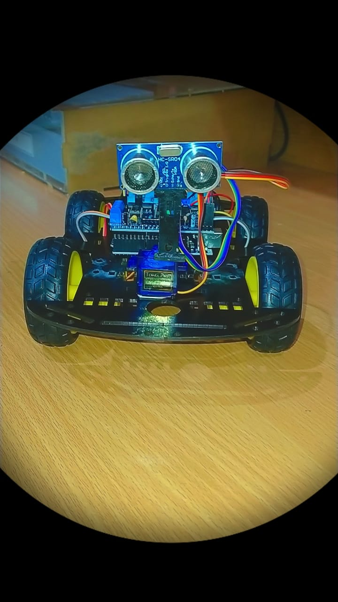
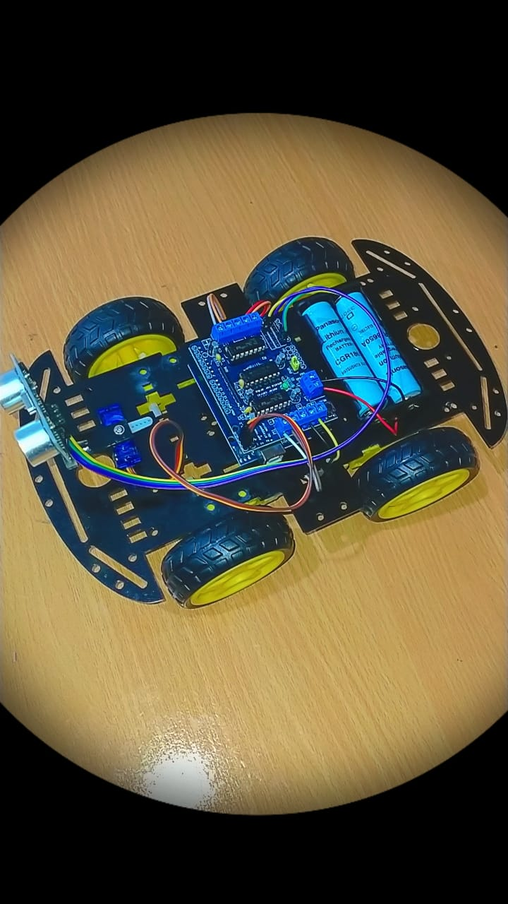
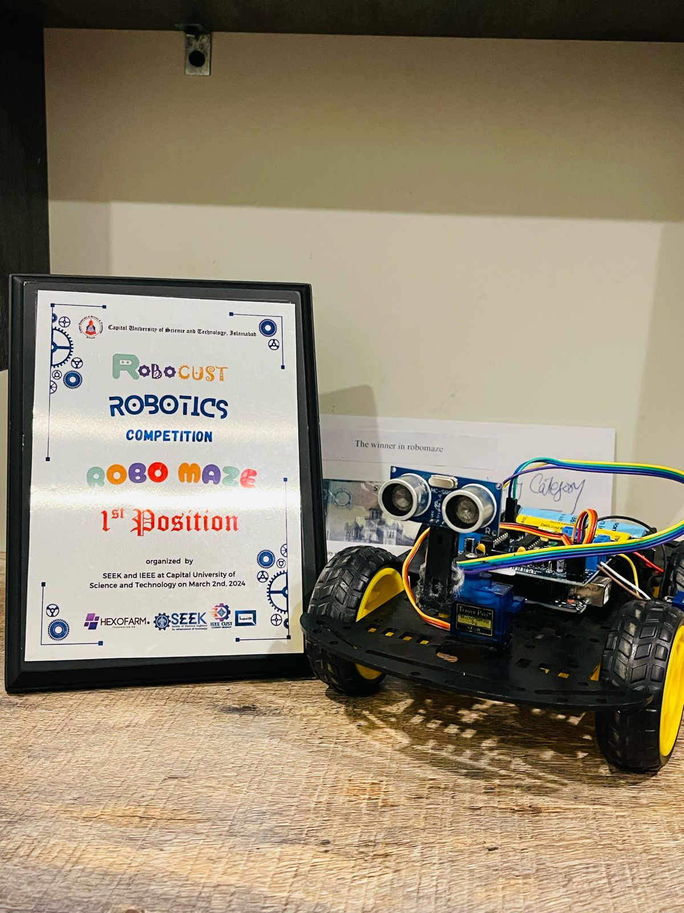

# 🚗 Obstacle Avoiding Car — Arduino

> **Autonomous self-navigating robot car using real-time ultrasonic sensing.**  
> 🎓 **Course:** Digital Logic Design (DLD)  
> 🏆 **Competed & Won at:** RoboCUST 2024 — Capital University of Science & Technology (CUST)

<br>


<br>

## 🏆 Achievement

> **1st Position — Robo Maze Category**  
> **RoboCUST Robotics Competition 2024**  
> 🏛️ Hosted by: Capital University of Science & Technology (CUST)  
> 🎓 Participant from: **STMU — Shifa Tameer-e-Millat University, Islamabad**

<br>

## 📌 About

This project is a fully autonomous obstacle-avoiding robot car powered by an **Arduino Uno**. It uses an **HC-SR04 ultrasonic sensor** mounted on an **SG90 servo motor** to continuously scan for obstacles. When an object is detected within 15 cm, the car stops, reverses, scans left and right, and turns toward the clearer path — all without any human input.

The project was built as part of the **Digital Logic Design (DLD)** course at **STMU** and demonstrates core concepts including combinational decision logic, sequential state control, PWM-based motor speed regulation, and real-time sensor feedback loops.

<br>

## ⚙️ Components

| # | Component | Details |
|---|-----------|---------|
| 1 | Microcontroller | Arduino Uno |
| 2 | Motor Driver | Adafruit Motor Shield v1 |
| 3 | Drive Motors | DC Gear Motors (×4) |
| 4 | Steering | SG90 Servo Motor |
| 5 | Distance Sensor | HC-SR04 Ultrasonic Sensor |
| 6 | Wheels | Rubber wheels (TT gear motor compatible) |
| 7 | Power Supply | 18650 Li-ion Battery |
| 8 | Wiring | Male & Female Jumper Wires |

<br>

## 🧠 How It Works

The car operates in a continuous feedback loop — sensing, deciding, and acting in real time:

**1️⃣ Startup & Initialization**
- Servo motor centres at **115°** (forward-facing position)
- Takes **4 warm-up sensor readings** to stabilise the HC-SR04 before the main loop begins

**2️⃣ Continuous Distance Monitoring**
- The **HC-SR04 ultrasonic sensor** fires a sound pulse every loop cycle via pin **A0 (TRIG)**
- The echo return time on pin **A1 (ECHO)** is converted to distance in centimetres using the **NewPing** library
- If no echo is received (open space), the sensor returns **250 cm** as a safe default

**3️⃣ Move Forward — Clear Path**
- If measured distance is **greater than 15 cm**, all four motors ramp up gradually to `MAX_SPEED (190)`
- Speed increases in steps of 2 every 5ms — protecting the battery from sudden inrush current

**4️⃣ Obstacle Detected — Stop & Reverse**
- If distance drops to **15 cm or less**, all motors stop immediately
- The car then **reverses for 300 ms** to create safe clearance from the obstacle

**5️⃣ Scan Right & Left**
- Servo sweeps to **50°** → sensor reads `distanceR` (right clearance)
- Servo sweeps to **170°** → sensor reads `distanceL` (left clearance)
- Servo returns to centre **(115°)** after each scan for accurate readings

**6️⃣ Smart Turn Decision**
- If `distanceR >= distanceL` → **Turn Right** (right side is clearer)
- If `distanceL > distanceR` → **Turn Left** (left side is clearer)
- After turning, all motors resume **forward motion** and the loop restarts

```
Power ON → Servo 115° → Warm-up readings
    └── Loop: Read distance
          ├── > 15 cm  ──────────────────→  Move Forward 🟢
          └── ≤ 15 cm  → Stop → Reverse
                              └── Scan Right (50°)  → distanceR
                              └── Scan Left  (170°) → distanceL
                                    ├── distanceR ≥ distanceL → Turn Right 🔄
                                    └── distanceL > distanceR → Turn Left  🔄
                                              └── Resume Forward 🟢
```

<br>

## 📐 Pin Configuration

| Component | Arduino Pin | Function |
|-----------|-------------|----------|
| HC-SR04 TRIG | A0 | Trigger pulse to sensor |
| HC-SR04 ECHO | A1 | Echo return from sensor |
| Servo Signal | D10 | SG90 servo position control |
| Motor Shield | D3, D11, D12, D13 | PWM & direction signals |
| Power | VIN / GND | 18650 Li-ion battery input |

<br>

## 📦 Required Libraries

Install via **Sketch → Include Library → Add .ZIP File** in Arduino IDE:

| Library | Install Link |
|---------|-------------|
| **AFMotor** | [Adafruit Motor Shield Library](https://learn.adafruit.com/adafruit-motor-shield/library-install) |
| **NewPing** | [Arduino-NewPing (GitHub)](https://github.com/livetronic/Arduino-NewPing) |
| **Servo** | [Arduino Servo Library (GitHub)](https://github.com/arduino-libraries/Servo.git) |

<br>

## 🚀 Getting Started

1. **Clone this repository**
   ```bash
   git clone https://github.com/Khansa972/obstacle-avoiding-car.git
   ```

2. **Install the three required libraries** (links above)

3. **Open the sketch**
   ```
   obstacle_avoiding_car.ino
   ```

4. **Connect hardware** according to the pin configuration table above

5. **Upload to Arduino Uno** via Arduino IDE  
   *(Board: Arduino Uno | Port: your COM port)*

6. **Power on** — the car will begin navigating autonomously

<br>

## 🔧 Key Parameters

```cpp
#define TRIG_PIN        A0    // Ultrasonic trigger pin
#define ECHO_PIN        A1    // Ultrasonic echo pin
#define MAX_DISTANCE   200    // Max sonar range in cm
#define MAX_SPEED      190    // Motor top speed (0–255)
```

Adjust `MAX_SPEED` (0–255) and the obstacle threshold (`<= 15` in `loop()`) to tune behaviour for different surfaces and environments.

<br>

## 📁 Repository Structure

```
obstacle-avoiding-car/
├── obstacle_avoiding_car.ino   # Main Arduino sketch
├── README.md                   # This file
├── LICENSE                     # MIT License
├── images/                     # Project photos & media
│   ├── car_front.jpg           # Front view of the car
│   ├── car_front1.jpg          # Front view of the car
│   ├── car_top.jpg             # Top view showing wiring
│   └── competition.jpg         # RoboCUST 2024 competition photo

```

### 🚗 The Car

| Front View | Top View |
|:----------:|:---------:|
|  |  |

### 🏆 RoboCUST 2024 Competition

<p align="center">
  
  <br>
  <em>RoboCUST 2024 — Robo Maze Category &nbsp;|&nbsp; 🏆 1st Place</em>
</p>

<br>

## 🧩 DLD Concepts Demonstrated

- **Combinational Logic** — Comparing `distanceR` vs `distanceL` to decide turn direction
- **Sequential Logic** — `goesForward` state flag prevents redundant motor ramp-ups
- **Feedback Control** — Continuous sensor polling drives real-time actuator responses
- **PWM Modulation** — Gradual speed ramp (0 → MAX_SPEED) emulates analog control digitally

<br>

## 👩‍💻 Author

**Khansa Bint-e-Zia**

[](https://github.com/Khansa972)
[](https://www.linkedin.com/in/khansa-bint-e-zia-791766361)

<br>

## 📄 License

This project is open-source under the [MIT License](LICENSE).

---

<div align="center">
  Made with ❤️ by <a href="https://github.com/Khansa972">Khansa Bint-e-Zia</a> &nbsp;|&nbsp; STMU &nbsp;|&nbsp; RoboCUST 2024 @ CUST &nbsp;|&nbsp; 🏆 1st Place — Robo Maze
</div>
